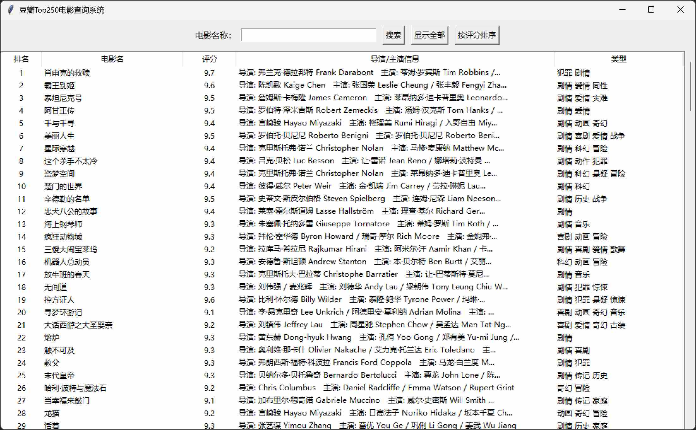
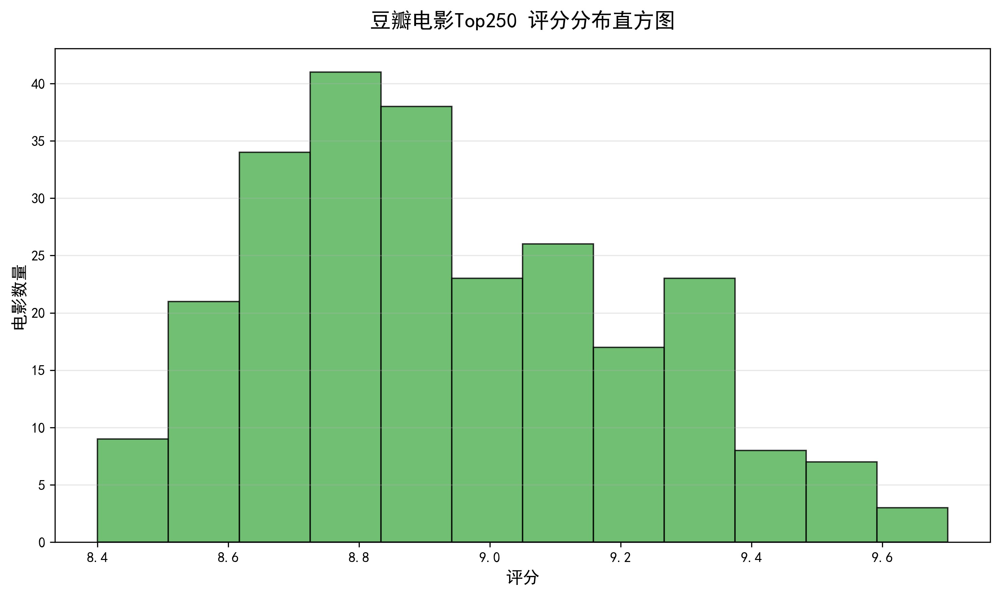
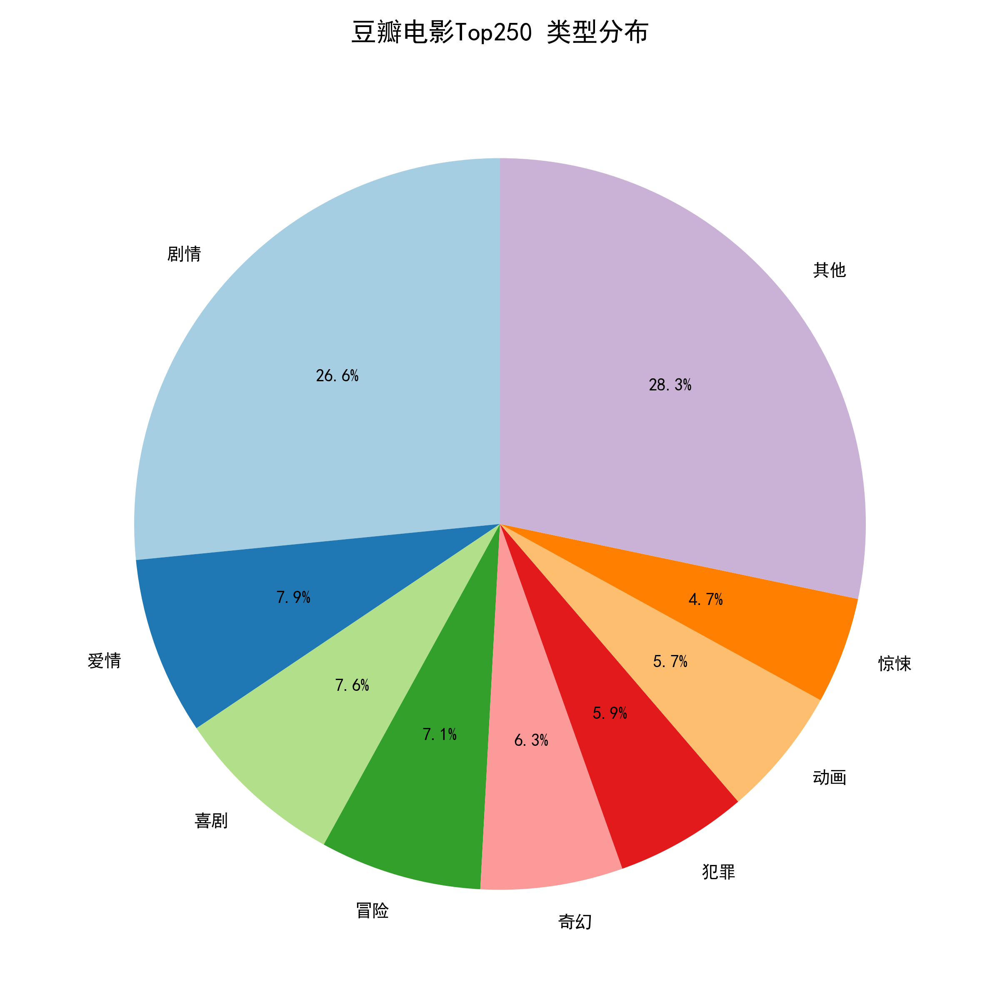
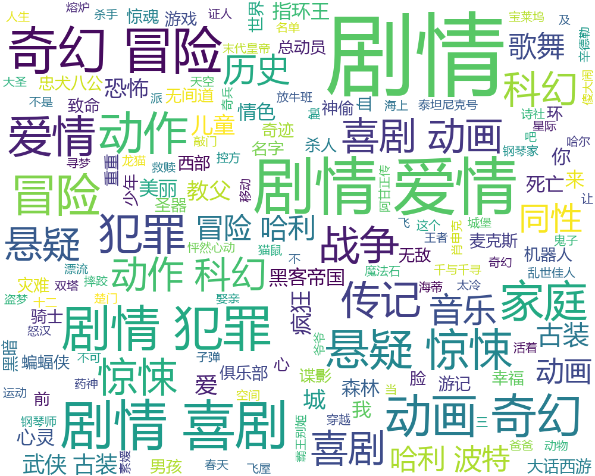

# 豆瓣Top250电影查询系统

## 项目简介
本项目用于爬取豆瓣电影 Top250 数据，并将数据存储在 CSV 文件中，同时提供图形化界面（GUI）方便用户浏览、搜索和排序电影信息。

功能包括：
- **爬虫模块**：抓取豆瓣电影 Top250 的电影名称、评分、导演/主演信息等。
- **数据处理模块**：清理抓取数据，去除无效字符，并保存为 `CSV` 文件。
- **GUI模块**：基于 Tkinter，实现电影查询、评分排序和详情查看。
- **项目文档**：AI 日志、README、分工说明。

## 项目结构
```text
douban-top250/
│
├── src
│   ├── douban_splder.py
│   ├── movie_data_analysis.py
│   └── main_gui.py
│
├── data
│   ├── 豆瓣电影Top250.csv
│   └── cleaned_豆瓣电影Top250.csv
│
├── images
│   ├── gui.png
│   ├── score_chart.png
│   ├── wordcloud.png
│   └── 类型饼图.png
│
├── README.md
├── AI_LOG.md
├── requirements.txt
└── .gitignore

项目采用小组协作开发模式，主要包含：

-   爬虫模块
    
-   数据存储模块
    
-   数据处理模块
    
-   数据可视化模块
    
-   Tkinter 图形界面模块
    
-   项目文档与 Git 协作管理
```
    

----------

## 功能介绍

### 1. 数据爬取

从豆瓣电影 Top250 页面获取：

-   电影名称
    
-   电影评分
    
-   导演信息
    
-   主演信息
    
-   简介信息
    

### 2. 数据存储

将爬取的数据保存到：

-   CSV 文件
    

（后续如有需要可扩展 SQLite 数据库）

### 3. 数据处理

对原始数据进行：

-   缺失值处理
    
-   格式统一
    
-   数据清洗
    
-   字段规范化
    

### 4. 数据可视化

实现：

-   评分统计图
    
-   电影数量统计图
    
-   词云展示
    

### 5. 图形界面（GUI）

基于 Tkinter 开发。

主要功能：

-   数据查看
    
-   数据查询
    
-   图表展示
    
-   词云展示
    
-   数据导出
    

----------

## 技术栈

### 开发语言

-   Python 3.x
    

### 第三方库

-   requests
    
-   beautifulsoup4
    
-   pandas
    
-   matplotlib
    
-   wordcloud
    
-   tkinter

    


----------

## 环境配置

安装依赖：

```bash
pip install requests beautifulsoup4 pandas matplotlib wordcloud

```

----------

## 运行方式

### 运行爬虫

```bash
python spider.py

```


### 启动 GUI

```bash
python gui.py

```

----------

## 小组分工

### 陈佳新

负责：

-   爬虫模块
    
-   数据库存储
    

### 郑宇婷

负责：

-   数据处理
    
-   图表分析
    
-   词云生成
    

### 王思茗

负责：

-   Tkinter 图形界面开发
    
-   README 编写
    

### 周晴（组长）

负责：

-   项目文档
    
-   Git 管理
    
-   PPT 制作
    
-   演示视频
    


----------

## GitHub 仓库

仓库地址：

```text
（项目完成后填写）

```

----------

## AI 开发说明

项目开发过程中使用 AI 工具辅助开发：

-   ChatGPT
    
-   通义千问
    

    

详细记录见：

```text
AI_LOG.md

```

----------

## 项目截图

### GUI主界面



### 数据可视化




### 词云展示



----------

## 项目总结

本项目通过爬虫技术获取豆瓣电影 Top250 数据，并结合数据处理、可视化分析以及图形界面开发，实现了完整的数据分析流程。

通过本项目掌握了：

-   Web爬虫开发
    
-   数据可视化
    
-   GUI开发
    
-   Git协同开发
    
-   AI辅助编程